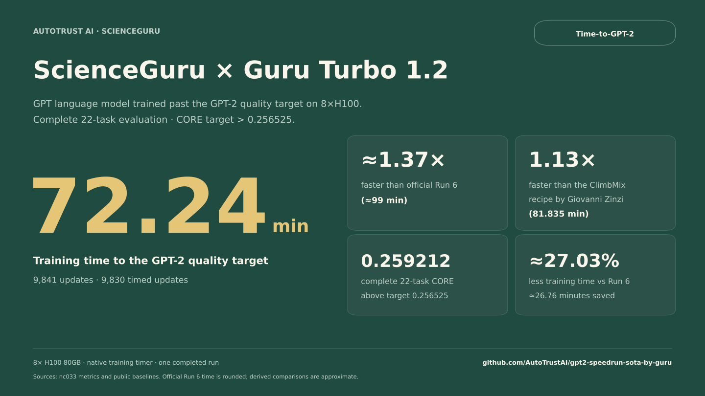
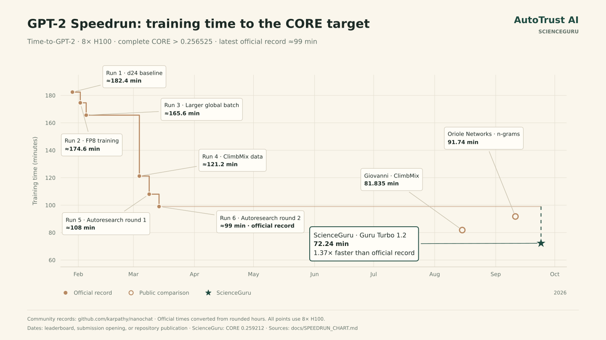
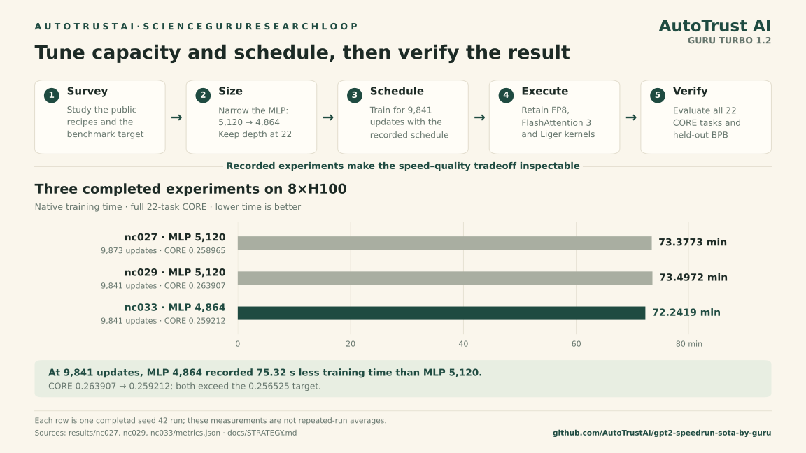

**AUTOTRUST AI  ·  SCIENCEGURU  ·  RESEARCH**

# New Record: ScienceGuru Cuts the GPT-2 Speedrun to 72.24 Minutes

Running Guru Turbo 1.2, AutoTrust’s research platform trained a GPT language model past the GPT-2 quality target in 72.24 minutes on eight H100s: approximately 1.37× faster than the official 99-minute record.

September 25, 2026  ·  ScienceGuru  ·  Guru Turbo 1.2  ·  Time-to-GPT-2

[中文](README.zh-CN.md)

Today we are releasing ScienceGuru’s result on Time-to-GPT-2, the open benchmark that asks how quickly a language model can be trained to match GPT-2’s downstream capability. Running Guru Turbo 1.2, ScienceGuru developed a recipe that reached a complete 22-task CORE score of **0.259212**, above the **0.256525** target, in **72.2419 minutes** on eight H100 GPUs.

That is approximately **1.37× faster** than the official Run 6 reference of 99 minutes, reducing training time by **27.03%**, or **26.76 minutes**. It is also **1.13× faster** than the 81.835-minute main ClimbMix recipe reported by Giovanni Zinzi and **1.27× faster** than Oriole Networks’ 91.74-minute result. Comparison sources were checked on September 24, 2026; calculations against the rounded official time are approximate. The code, logs, source hashes and verification instructions are open at [github.com/AutoTrustAI/gpt2-speedrun-sota-by-guru](https://github.com/AutoTrustAI/gpt2-speedrun-sota-by-guru).

*One completed run on 8×H100, evaluated on all 22 CORE tasks. Comparisons with the rounded official Run 6 time are approximate. [Download scorecard PNG](assets/gpt2-scorecard.png) · [Detailed comparison](assets/gpt2-comparison.svg) · [Data and sources](docs/BENCHMARK.md#public-comparisons).*

## Why the GPT-2 speedrun

The speedrun fixes the hardware and the target: train on one 8×H100 node until the model exceeds GPT-2’s reference CORE of 0.256525. CORE combines performance across 22 tasks, adjusted for each task’s random baseline. Reaching the target requires both a fast training system and a model that learns enough from the data. Architecture, numerical precision, GPU kernels, memory use and convergence all affect the result.

The benchmark is maintained by [Andrej Karpathy in nanochat](https://github.com/karpathy/nanochat). Its six official runs chart improvements through FP8 training, larger batches, ClimbMix data and two rounds of autoresearch. The latest official reference in this comparison is Run 6, at about 99 minutes and CORE 0.262634.

Public contributors have pushed the system further. [Giovanni Zinzi’s main recipe](https://github.com/karpathy/nanochat/pull/830) reports fused cross entropy, selective RMSNorm scales and a 49,152-token speedrun vocabulary. [Nihir Patel, Alessandro Ottino and Robin Matzner at Oriole Networks](https://github.com/karpathy/nanochat/pull/854) explore a host-memory n-gram table. Their results provide additional points of comparison for reaching the same quality threshold. [Contributor backgrounds and sources](docs/TEAMS.md).

*Six official nanochat runs, leading public comparisons and ScienceGuru’s result. The official reference is reported in rounded minutes. [History data and sources](docs/SPEEDRUN_CHART.md) · [Download PNG](assets/speedrun-history.png).*

## What ScienceGuru changed

The result comes from matching model capacity and the training horizon to the quality target while retaining the existing fast execution path. ScienceGuru’s published recipe uses a 22-layer GPT, narrows the feed-forward network, and trains for 9,841 updates. The repository preserves the earlier completed experiments alongside the fastest qualifying result, so the speed and quality tradeoff can be inspected directly.

### 1. Reducing the feed-forward width

The final model keeps 22 transformer layers, a model width of 1,408, 11 attention heads, a 49,152-token vocabulary and a 2,048-token context. The change is in the MLP: its hidden width falls from 5,120 to 4,864. That removes **15,859,712 parameters** and approximately **2.56% of estimated per-token FLOPs**. The resulting model has 1,375,503,474 parameters.

At the same 9,841-update horizon, the recorded MLP5120 run took **73.4972 minutes**, while MLP4864 took **72.2419 minutes**, saving **75.32 seconds**. CORE changed from 0.263907 to 0.259212, still above the target; validation bits per byte changed from 0.723137 to 0.724029. The improvement trades some measured quality margin for lower training time. [Complete experiment results](docs/RESULTS.md).

### 2. Setting an explicit training horizon

The recipe trains for **9,841 updates**, processing **5,159,518,208 tokens**. Each update uses a global batch of 524,288 tokens, with 32 sequences per GPU. Training uses 170 ClimbMix shards and the original held-out validation shard.

The explicit iteration count sets the horizon, while `target_param_data_ratio=9.20` remains an input to the original hyperparameter scaling. The schedule uses 40 warmup steps, a 0.65 warmdown fraction and a final learning-rate fraction of 0.05. Weight decay and the optimizer equations stay unchanged. [Exact recipe and launch arguments](reproduction/recipes.json).

### 3. Retaining the fast execution path

The model uses tensorwise FP8 matrix computation with BF16 around it, FlashAttention 3, the original Liger fused softcapped cross entropy, and the original Muon/AdamW optimizer implementation. The attention-window pattern remains SSSL. These are the execution foundations retained by the published recipe; the archived comparison isolates the smaller MLP at the same update count.

The training and model source is copied from the recorded experimental revision. The package includes exact configurations, dependency versions and source hashes so that the measured recipe can be reconstructed. [Technical strategy](docs/STRATEGY.md) · [Reproduction guide](docs/REPRODUCE.md).

*The recorded experiments show the speed–quality tradeoff. At 9,841 updates, MLP4864 used 75.32 seconds less training time than MLP5120; both reached the CORE target. Each row is one completed run. [Download workflow PNG](assets/gpt2-research-loop.png) · [Experiment results](docs/RESULTS.md).*

## How we verified it

Speed results are easy to get wrong, so the package is built to be checked:

- **Complete downstream evaluation.** The checkpoint is restored with the same MLP4864 configuration and evaluated on every example in all 22 CORE tasks using `--max-per-task=-1`. The resulting CORE is 0.259212. Standard BPB evaluation uses 20,971,520 tokens per split and gives validation BPB of 0.724029. The individual task scores, including declines, are preserved.

- **The native timing boundary.** The original `total_training_time` is **4,334.512382 seconds**, covering **9,830 timed updates** out of 9,841. The first eleven update records, evaluation, logging and checkpoint writing are outside that timer. Setup, tokenizer preparation and final evaluation add time to a complete reproduction.

- **Recorded experiments.** The published result is one completed seed 42 run, nc033. The package also retains the two earlier completed MLP5120 experiments, nc027 and nc029, with their configurations, full CORE results and native metric lines. No projected result is included in the measured table.

- **Pinned source and artifacts.** The source manifest identifies 22 unchanged source, license and dependency files from revision `a72e2f4b16595a3409edc39b00e07e22bee45c09`. Separate manifests record hashes of the published results and reproduction package. Run `python3 reproduction/verify.py source` to check the frozen source on a CPU; the [evidence guide](docs/EVIDENCE.md#verify-the-published-package) includes the artifact checks.

## Scope and caveats

- This is one qualifying run selected from recipe development. It does not establish variability across repeated runs. The comparison recipes report their own run counts and aggregates, and their final CORE scores differ.

- The reported figure measures the native training interval. It does not include the full research process or the entire time required to prepare inputs, train and evaluate from scratch.

- The input manifest records training-shard names and sizes, with hashes for held-out data, tokenizer artifacts and evaluation files. Full training-shard content hashes were not recorded, and the external FlashAttention 3 binary revision is not pinned by the dependency lock.

- The measurements come from the original archived runs. The portable launch scripts have passed static and describe-mode checks; their end-to-end GPU execution remains to be validated. Dataset contents, tokenizer artifacts, trained weights and compiled kernel caches are obtained or produced during reproduction.

## What’s next

The release makes the next checks concrete: reproduce the frozen recipe from scratch, run the complete downstream evaluation and measure how the result varies across fresh runs. The source manifests, launch commands and individual task scores give other researchers the materials to inspect both training efficiency and the quality margin above the target.

AutoTrust is an applied AI research laboratory based in Singapore, working on scientific agents, sustained research tasks and self-improving coding agents. Its ScienceGuru workspace brings research models into literature reading, scientific reasoning, writing and experimentation. Guru Turbo 1.2 is the model used for the research and coding in this project; the reported 72.24 minutes measures the GPT model’s training recipe. [AutoTrust](https://autotrust.ai/about) · [Guru models](https://autotrust.ai/models) · [Project attribution](provenance/project-attribution.json).

### SCIENCEGURU

Put the system behind this result to work on your own research. Download ScienceGuru at [ScienceGuru.ai](https://scienceguru.ai).

[Download ScienceGuru →](https://scienceguru.ai)

Code, logs and verification: [github.com/AutoTrustAI/gpt2-speedrun-sota-by-guru](https://github.com/AutoTrustAI/gpt2-speedrun-sota-by-guru)

Community records: [karpathy/nanochat — Time-to-GPT-2](https://github.com/karpathy/nanochat/blob/92d63d4e8bb4df75c3b71618f31ddde2378b2bcd/dev/LEADERBOARD.md). Official times are taken from the recorded leaderboard reference.

Built on [karpathy/nanochat](https://github.com/karpathy/nanochat). Upstream copyright and the MIT license are retained in [LICENSE](LICENSE) and [NOTICE](NOTICE).
