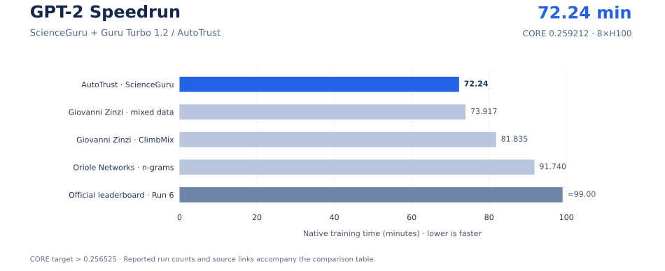

# ScienceGuru: GPT-2 in 72.2419 minutes — ≈1.37× speedup over the official SOTA

**AutoTrust's ScienceGuru research platform, using Guru Turbo 1.2, trains a GPT language model past the GPT-2 quality target in 72.2419 minutes on 8×H100.** The complete 22-task CORE score is **0.259212**, above the **0.256525** target. This uses **≈27.03% less training time than the official SOTA of ≈99 minutes**, saving **≈26.76 minutes**. [Results and comparison sources](docs/BENCHMARK.md).

| Training time | Speedup over official SOTA | Training time saved | Complete CORE |
|---:|---:|---:|---:|
| **72.2419 min** | **≈1.37×** | **≈27.03%** | **0.259212** |

The nanochat leaderboard records **six 8×H100 runs** progressing through FP8 training, larger batches, ClimbMix data, and two rounds of autoresearch. The history below places ScienceGuru's result alongside that progression and the leading public comparisons.

[Chart data and sources](docs/SPEEDRUN_CHART.md) · [Download history PNG](assets/speedrun-history.png)

[Chinese](README.zh-CN.md) · [Reproduce](docs/REPRODUCE.md) · [Strategy](docs/STRATEGY.md) · [Evidence](docs/EVIDENCE.md) · [Results](docs/RESULTS.md) · [Teams and contributors](docs/TEAMS.md) · [Benchmark protocol](docs/BENCHMARK.md)

## AutoTrust, ScienceGuru, and Guru Turbo 1.2

### AutoTrust

[**AutoTrust**](https://autotrust.ai/about) is an applied AI research laboratory based in Singapore, developing AI systems for scientific research. Its work spans scientific agents, sustained research tasks, self-improving coding agents, and AI scientists. The lab connects real research workflows with model training, inference, and agent orchestration to build more capable research systems.

### ScienceGuru

[**ScienceGuru**](https://scienceguru.ai/) is AutoTrust's research workspace for scientific exploration, reading, reasoning, and writing, available on the web and desktop. It brings research models into an ongoing workspace where ideas can be developed into experiments. This project applies that workflow to GPT pretraining: investigating bottlenecks, implementing candidate strategies, running experiments, and evaluating the resulting models.

### Guru Turbo 1.2

**Guru Turbo 1.2** is the model used for the research and coding work in this ScienceGuru project. AutoTrust's [**Guru family**](https://autotrust.ai/models) includes Nano, Pro, and Turbo tiers for scientific-agent workloads and sustained research tasks. Here, Guru Turbo 1.2 develops the training strategy; the benchmark measures the GPT language model implemented in [`nanochat/`](nanochat/). [Project attribution](provenance/project-attribution.json).

The strategy uses a 22-layer GPT with a compact feed-forward network, an explicit training horizon, FP8 execution, FlashAttention 3, and fused cross entropy. Together, these reduce the work per update and the time needed to reach the downstream quality target. [Technical strategy](docs/STRATEGY.md).

## Measured result

**AutoTrust · ScienceGuru · Guru Turbo 1.2** achieved **72.2419 minutes** with **9,841 training updates** and a complete **22-task CORE of 0.259212**. This is a fresh seed 42 run on **8×H100 80GB**. Independent evaluation gives **0.724029 validation bits per byte**.

The native `total_training_time` is **4,334.512382 seconds**, covering **9,830 timed updates**. The training loop excludes its first eleven update records, evaluation, logging, and checkpoint writing from that timer. See the [timing protocol](docs/BENCHMARK.md#core-and-timing).

[Full result and configuration](results/nc033/) · [Experiment history](results/experiments.json) · [Evidence guide](docs/EVIDENCE.md)

## Performance comparison

Results checked on **2026-09-24 UTC**, for **8×H100 / CORE >0.256525**, ordered by training time. Each reference uses its reported time and run count; ScienceGuru uses the completed seed 42 result. The official 99-minute reference is rounded.

[Download comparison PNG](assets/gpt2-comparison.png) · [Comparison data](assets/comparison-data.json) · [Sources and protocol](docs/BENCHMARK.md)

| Strategy | Team / contributor | Training time | CORE | Runs | ScienceGuru speedup |
|---|---|---:|---:|---:|---:|
| **ScienceGuru, MLP4864** | **AutoTrust · Guru Turbo 1.2** | **72.2419 min** | **0.259212** | **1** | — |
| [ClimbMix / Cosmopedia mixture](https://github.com/karpathy/nanochat/pull/830) | Giovanni Zinzi | **73.917 min** | 0.267123 | 3 | **1.023×** |
| [ClimbMix recipe](https://github.com/karpathy/nanochat/pull/830) | Giovanni Zinzi | **81.835 min** | 0.261814 | 6 | **1.133×** |
| [Host-RAM n-grams](https://github.com/karpathy/nanochat/pull/854) | Oriole Networks · Nihir Patel and collaborators | **91.74 min** | 0.2578 | 3 | **1.270×** |
| [**Official SOTA — Run 6**](https://github.com/karpathy/nanochat/blob/92d63d4e8bb4df75c3b71618f31ddde2378b2bcd/dev/LEADERBOARD.md#run-6) | Andrej Karpathy | **≈99 min** | 0.262634 | 5 | **≈1.370×** |

Against the official Run 6 reference, ScienceGuru saves **≈26.76 minutes**, a **≈1.370× speedup**. Against the **73.917-minute** mixed-data result, it saves **100.51 seconds**, using **2.27% less training time**. The model is trained on ClimbMix with the original tokenizer and complete downstream evaluation. [Comparison details](docs/BENCHMARK.md#public-comparisons).

## Background of the leading contributors

| Contributor | Public background | Result in this comparison |
|---|---|---|
| **Andrej Karpathy** | Creator and maintainer of [nanochat](https://github.com/karpathy/nanochat); the latest official run incorporates a second round of autoresearch. | **≈99 min** |
| **Giovanni Zinzi** | Author of [#830](https://github.com/karpathy/nanochat/pull/830), which reports fused cross entropy, selective RMSNorm scales, and a 49,152-token speedrun vocabulary. | **81.835 min**; mixed data **73.917 min** |
| **Oriole Networks · Nihir Patel and collaborators** | [#854](https://github.com/karpathy/nanochat/pull/854) names Nihir Patel, Alessandro Ottino, and Robin Matzner at Oriole Networks. | **91.74 min** |

[Recursive](https://github.com/recursive-org/first-steps-toward-automated-ai-research/tree/main/nanochat_autoresearch) also publishes NanoChat autoresearch experiments, reporting **0.9109 mean validation BPB** over ten seeds on one B200 with a five-minute budget. That experiment uses a different hardware and evaluation protocol. [Teams, contributions, and related work](docs/TEAMS.md).

## What this benchmark establishes

Time-to-GPT-2 measures **training time to a fixed downstream capability target**. Reaching the target requires model capacity, data quality, and convergence as well as fast GPU execution. The benchmark exercises architecture design, precision choices, GPU kernels, distributed communication, memory use, and reproducible experimentation.

Its research value is the link between systems speed and model capability: an optimization succeeds when it produces a sufficiently capable GPT model sooner. The official history includes improvements discovered through autoresearch, making it a concrete setting for studying AI-assisted training research. [Benchmark significance and CORE evaluation](docs/BENCHMARK.md).

## What is included

- [`nanochat/`](nanochat/) and [`scripts/`](scripts/): the frozen training, model, tokenizer, and evaluation implementation.
- [`reproduction/source-manifest.json`](reproduction/source-manifest.json): hashes for 22 preserved source, license, and dependency files.
- [`results/`](results/): three completed experiments, per-task CORE scores, native training logs, and evaluation metrics.
- [`docs/REPRODUCE.md`](docs/REPRODUCE.md): environment, dataset, and launch instructions for the 9,841-update recipe.
- [`docs/EVIDENCE.md`](docs/EVIDENCE.md): source identity, result files, and verification commands.

The reference hardware is **8× NVIDIA H100 80GB**. Training uses **170 ClimbMix shards**, a held-out validation shard, a **49,152-token** tokenizer, sequences of **2,048 tokens**, and a global batch of **524,288 tokens**. Follow [Reproduce](docs/REPRODUCE.md) to install the recorded dependencies, prepare the inputs, train from scratch, and run complete CORE and BPB evaluation.

## Credits and license

Built on [karpathy/nanochat](https://github.com/karpathy/nanochat). Upstream copyright and the MIT license are retained in [LICENSE](LICENSE) and [NOTICE](NOTICE). [Source and dependency attribution](NOTICE) · [ScienceGuru project attribution](provenance/project-attribution.json).
